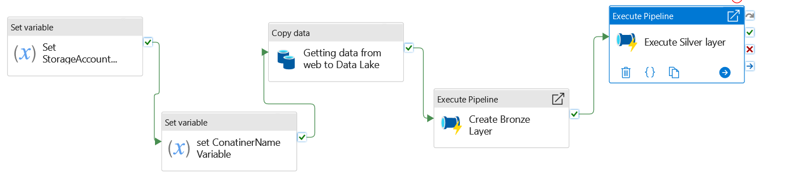
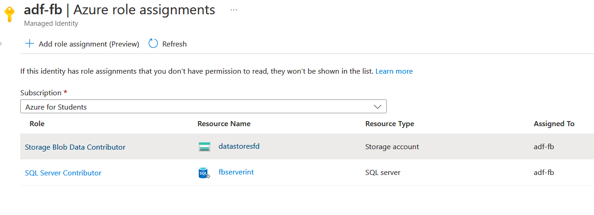
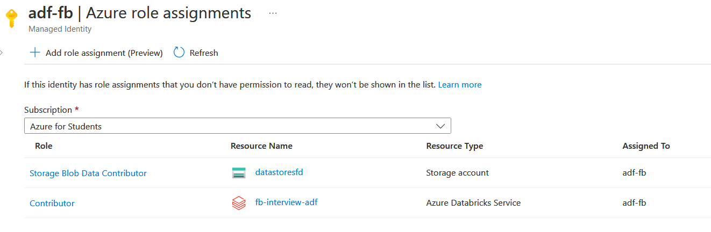

# Azure Data Factory

This repository contains an Azure Data Factory pipeline that utilizes Azure Blob as a data lake and Azure Databricks to perform transformations and load the refined data to Azure Sql database. The pipeline is designed to use managed identity to connect to different Azure services.




## Prerequisites
To run this pipeline, you need the following prerequisites:

- An Azure subscription.
- An Azure Data Factory.
- An Azure Blob storage account with a container for your data lake.
- An Azure key vault (store shared access key of the storage account)
- An Azure Databricks workspace.
  - Clone the git repo to databricks env as well.
  - create secret scope in azure databricks pointing to azure key vault to read the Shared access key 
- An Azure Log Analytics is used to monitor the pipeline.


## Pipeline Design
The pipeline is designed with the following components:

- Data source: Azure Blob storage account.
- Data transformation: Azure Databricks.
- Data sink: Azure SQL Database.

The data source contains the raw data that needs to be transformed. This data is read by the Azure Data Factory pipeline and passed to the Azure Databricks workspace for processing. The transformed data is then written back to the data sink, which is Azure SQL Database.

## Getting Started
To run this pipeline, you need to complete the following steps:

- Create an Azure Blob storage account and container for your data lake and add the input file to the location.
- Create an Azure Databricks workspace.
- Clone this repository to an Azure Data Factory.

## Few sample codes and access configuration that are used

```sql
CREATE USER [adf-fb] FROM EXTERNAL PROVIDER;  
--For read/write access.   
ALTER ROLE db_datareader ADD MEMBER [adf-fb]  
ALTER ROLE db_datawriter ADD MEMBER [adf-fb]

```
Granting read and write role to user managed Identity in SQL Server.


```json
{
    "id": "/subscriptions//resourcegroups/Interviewfabledata/providers/Microsoft.ManagedIdentity/userAssignedIdentities/adf-fb",
    "name": "adf-fb",
    "type": "Microsoft.ManagedIdentity/userAssignedIdentities",
    "location": "uksouth",
    "tags": {},
    "properties": {
        "tenantId": "",
        "principalId": "",
        "clientId": ""
    }
}
```




User managed Identity is used to connect to different Azure resources like blob, SQL database and databricks environment.


## Conclusion
This pipeline is designed to provide an end-to-end solution for transforming data using Azure Data Factory and Azure Databricks. The use of managed identity ensures secure access to different Azure services, making it a secure and reliable solution for data processing.